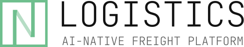

 

<picture>
  <source media="(prefers-color-scheme: dark)" srcset="../images/logo_light.svg">
  <source media="(prefers-color-scheme: light)" srcset="../images/logo_dark.svg">
  
</picture>

 
 

**AI-агенты, Telegram-боты и веб-сервисы, которые берут рутину на себя.**

 

<picture><source media="(prefers-color-scheme: dark)" srcset="https://img.shields.io/badge/AI--%D0%B0%D0%B3%D0%B5%D0%BD%D1%82%D1%8B-242424?style=flat-square"></picture>
<picture><source media="(prefers-color-scheme: dark)" srcset="https://img.shields.io/badge/Telegram--%D0%B1%D0%BE%D1%82%D1%8B-242424?style=flat-square"></picture>
<picture><source media="(prefers-color-scheme: dark)" srcset="https://img.shields.io/badge/%D0%92%D0%B5%D0%B1--%D1%81%D0%B5%D1%80%D0%B2%D0%B8%D1%81%D1%8B-242424?style=flat-square"></picture>
<picture><source media="(prefers-color-scheme: dark)" srcset="https://img.shields.io/badge/%D0%90%D0%B2%D1%82%D0%BE%D0%BC%D0%B0%D1%82%D0%B8%D0%B7%D0%B0%D1%86%D0%B8%D1%8F%20%D0%B1%D0%B8%D0%B7%D0%BD%D0%B5%D1%81%D0%B0-242424?style=flat-square"></picture>

 

---

**Nexorium** — студия разработки ПО. Берём задачу бизнеса и доводим её до готового продукта: проектирование, дизайн, бэкенд, AI, поддержка в проде. Один партнёр на весь цикл, от идеи до запуска.

 

## Что мы делаем

<table>
  <tr>
    <td width="190" align="center">
      <picture>
        <source media="(prefers-color-scheme: dark)" srcset="../images/logo-logistics-light.svg">
        <source media="(prefers-color-scheme: light)" srcset="../images/logo-logistics-dark.svg">
        
      </picture>
    </td>
    <td>
      AI-ассистент для грузоперевозчиков. Общается с клиентами круглосуточно, понимает, что и куда везти, считает стоимость маршрута и отдаёт менеджеру готовый лид.
    </td>
  </tr>
  <tr>
    <td width="190" align="center">
      <picture>
        <source media="(prefers-color-scheme: dark)" srcset="../images/botfarm_logo_light.svg">
        <source media="(prefers-color-scheme: light)" srcset="../images/botfarm_logo_dark.svg">
        
      </picture>
    </td>
    <td>
      Персональный outreach в Telegram в любом масштабе. Аккаунты под управлением AI первыми пишут, ведут диалог, оценивают интерес и передают горячие лиды менеджерам.
    </td>
  </tr>
  <tr>
    <td width="190" align="center">
      <picture>
        <source media="(prefers-color-scheme: dark)" srcset="../images/logo_light.svg">
        <source media="(prefers-color-scheme: light)" srcset="../images/logo_dark.svg">
        
      </picture>
    </td>
    <td>
      Наш сайт и живая демонстрация подхода. AI-консультант разбирается в задаче посетителя и превращает её в готовую заявку для команды.
    </td>
  </tr>
</table>

 

## Технологии, которые мы используем

**Языки & Backend**

<picture><source media="(prefers-color-scheme: dark)" srcset="https://img.shields.io/badge/Python-242424?style=flat-square&logo=python&logoColor=white"></picture>
<picture><source media="(prefers-color-scheme: dark)" srcset="https://img.shields.io/badge/TypeScript-242424?style=flat-square&logo=typescript&logoColor=white"></picture>
<picture><source media="(prefers-color-scheme: dark)" srcset="https://img.shields.io/badge/FastAPI-242424?style=flat-square&logo=fastapi&logoColor=white"></picture>
<picture><source media="(prefers-color-scheme: dark)" srcset="https://img.shields.io/badge/SQLAlchemy-242424?style=flat-square&logo=sqlalchemy&logoColor=white"></picture>
<picture><source media="(prefers-color-scheme: dark)" srcset="https://img.shields.io/badge/Pydantic-242424?style=flat-square&logo=pydantic&logoColor=white"></picture>
<picture><source media="(prefers-color-scheme: dark)" srcset="https://img.shields.io/badge/Alembic-242424?style=flat-square"></picture>

**AI & LLM**

<picture><source media="(prefers-color-scheme: dark)" srcset="https://img.shields.io/badge/LangChain-242424?style=flat-square&logo=langchain&logoColor=white"></picture>
<picture><source media="(prefers-color-scheme: dark)" srcset="https://img.shields.io/badge/LangGraph-242424?style=flat-square"></picture>
<picture><source media="(prefers-color-scheme: dark)" srcset="https://img.shields.io/badge/OpenAI-242424?style=flat-square&logo=openai&logoColor=white"></picture>

**Frontend**

<picture><source media="(prefers-color-scheme: dark)" srcset="https://img.shields.io/badge/Next.js-242424?style=flat-square&logo=nextdotjs&logoColor=white"></picture>
<picture><source media="(prefers-color-scheme: dark)" srcset="https://img.shields.io/badge/React-242424?style=flat-square&logo=react&logoColor=white"></picture>
<picture><source media="(prefers-color-scheme: dark)" srcset="https://img.shields.io/badge/Tailwind%20CSS-242424?style=flat-square&logo=tailwindcss&logoColor=white"></picture>
<picture><source media="(prefers-color-scheme: dark)" srcset="https://img.shields.io/badge/shadcn%2Fui-242424?style=flat-square&logo=shadcnui&logoColor=white"></picture>
<picture><source media="(prefers-color-scheme: dark)" srcset="https://img.shields.io/badge/TanStack%20Query-242424?style=flat-square&logo=reactquery&logoColor=white"></picture>
<picture><source media="(prefers-color-scheme: dark)" srcset="https://img.shields.io/badge/Zod-242424?style=flat-square&logo=zod&logoColor=white"></picture>

**Infra**

<picture><source media="(prefers-color-scheme: dark)" srcset="https://img.shields.io/badge/PostgreSQL-242424?style=flat-square&logo=postgresql&logoColor=white"></picture>
<picture><source media="(prefers-color-scheme: dark)" srcset="https://img.shields.io/badge/Redis-242424?style=flat-square&logo=redis&logoColor=white"></picture>
<picture><source media="(prefers-color-scheme: dark)" srcset="https://img.shields.io/badge/MinIO-242424?style=flat-square&logo=minio&logoColor=white"></picture>
<picture><source media="(prefers-color-scheme: dark)" srcset="https://img.shields.io/badge/RabbitMQ-242424?style=flat-square&logo=rabbitmq&logoColor=white"></picture>
<picture><source media="(prefers-color-scheme: dark)" srcset="https://img.shields.io/badge/Apache%20Kafka-242424?style=flat-square&logo=apachekafka&logoColor=white"></picture>
<picture><source media="(prefers-color-scheme: dark)" srcset="https://img.shields.io/badge/Docker-242424?style=flat-square&logo=docker&logoColor=white"></picture>

**Tools**

<picture><source media="(prefers-color-scheme: dark)" srcset="https://img.shields.io/badge/Telegram-242424?style=flat-square&logo=telegram&logoColor=white"></picture>
<picture><source media="(prefers-color-scheme: dark)" srcset="https://img.shields.io/badge/uv-242424?style=flat-square&logo=uv&logoColor=white"></picture>
<picture><source media="(prefers-color-scheme: dark)" srcset="https://img.shields.io/badge/Bun-242424?style=flat-square&logo=bun&logoColor=white"></picture>
<picture><source media="(prefers-color-scheme: dark)" srcset="https://img.shields.io/badge/Ruff-242424?style=flat-square&logo=ruff&logoColor=white"></picture>
<picture><source media="(prefers-color-scheme: dark)" srcset="https://img.shields.io/badge/pytest-242424?style=flat-square&logo=pytest&logoColor=white"></picture>

 

---

Сделано в Nexorium

